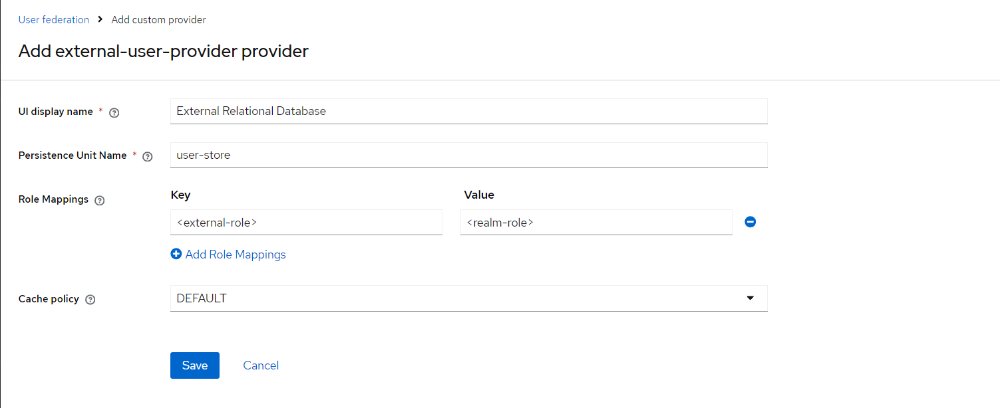

<p align="center">
  
</p>
<p align="center">
    <h1 align="center">KEYCLOAK-USER-SPI</h1>

<p align="center">
    <em>User storage provider implementation in Keycloak</em>
</p>
<p align="center">
	
	
	
<p>
<br><!-- TABLE OF CONTENTS -->
<details>
  <summary>Table of Contents</summary><br>

- [ Overview](#overview)
  - [ Introduction](#introduction)
  - [ About the Project](#about-the-project)
  - [ External Storage Augmentation](#external-storage-augmentation)
- [ Configuration](#configuration)
  - [ External Database Configuration](#external-database-configuration)
  - [ Persistence Unit Configuration](#persistence-unit-configuration)
- [ Getting Started](#getting-started)
  - [ Build and Deploy the Provider](#build-and-deploy-the-provider)
  - [ Usage](#usage)
- [ References](#references)
</details>
<hr>

##  Overview
This project showcases a Keycloak User Storage SPI that connects with external relational databases.

---
### Introduction
By default, Keycloak relies on its internal database to handle user creation, updates, lookups, and credential validation. 
Developers can implement the User Storage SPI to connect external user databases with Keycloak’s internal user management system.

When Keycloak needs to locate a user, for instance, during a login attempt, it follows a specific process. 
It first checks the user cache; if the user is found there, it uses that in-memory data. 
If not, Keycloak searches its local database. If the user is still not located, Keycloak then queries the User Storage 
SPI provider implementations in sequence until one returns the desired user.

---
### About the Project
This project will implement the User Storage SPI to connect to an external, pre-populated [database](scripts/external-db/init-db.sql).
The user model in the external store is composed of the below attributes:
- ID
- Username
- Email
- Password
- User Role
- First Name
- Last Name
- Created Date

The provider will **read only** those attributes; it will be able to look up users by ID, username, role,
as well as validate users' passwords. Also, the provider will map the user's role from the external store
into a realm role based on the mappings, if any, defined when creating the provider.

---


### External Storage Augmentation

Since the external storage cannot accommodate all Keycloak features, such as additional user attributes, group management, 
and various credential types, this provider lets you extend your external storage by saving extra information in Keycloak’s 
database. For instance, if a user is assigned to a group and the external store does not support group relationships, 
Keycloak will store this group assignment in its own federated database relations while maintaining a reference to the 
external user ID.  Later, if the provider was deleted from the realm, all information related to external users coming 
from the provider will be deleted too. This is achieved by overriding methods from `AbstractUserAdapterFederatedStorage` 
that are supported in the external store. Non-overridden methods will be managed in Keycloak's federated database relations, 
such as groups assignment, required actions, etc.

---

##  Configuration


###  External Database Configuration
When configuring a Keycloak User Storage SPI with an external datasource, you need to specify datasource properties in the [quarkus.properties](quarkus.properties) file.
This file is then copied to the `conf` directory of the server.

#### Parameters:

- `quarkus.datasource.user-store.db-kind`: Defines the type of database.

- `quarkus.datasource.user-store.username`: Specifies the username for connecting to the external datasource.

- `quarkus.datasource.user-store.password`: Specifies the password for connecting to the external datasource.

- `quarkus.datasource.user-store.jdbc.url`: Sets the JDBC URL for the external datasource.


### Persistence Unit Configuration

A persistence unit defines the configurations that are required when acquiring an entity manager.
The [persistence.xml](src/main/resources/META-INF/persistence.xml) file, which defines the required configurations, 
should be located in the `META-INF` directory of your provider.

#### Parameters:

- `name`: Assign a unique name to your persistence unit.
- `transaction-type`: Set to JTA (Java Transaction API) to use container-managed transactions. You can also set this to RESOURCE_LOCAL if you want to manage transactions manually.
- `<class>`: Define the entity classes that are part of this persistence unit. List all entity classes that should be managed.
- `hibernate.dialect`: Specify the Hibernate dialect for your database. This ensures Hibernate generates SQL compatible with your database.
- `hibernate.connection.datasource`: Provide the name of the datasource. This name should match the datasource configured in [quarkus.properties](quarkus.properties).
- `jakarta.persistence.transactionType`:  The transaction type.
- `hibernate.hbm2ddl.auto`: Determines how Hibernate manages schema creation. Common values are none (no automatic schema management), update (update the schema), create (create schema), and create-drop (create and drop schema).
- `hibernate.show_sql`: Set to true to enable SQL logging for debugging purposes. Set to false to disable SQL logging.

**Note**: You can configure multiple persistence units in the same file. 
Each persistence unit should have a unique name and can have different settings depending on your needs.

---

## Getting Started

**System Requirements:**

- JDK 21+
- Apache Maven 3+
- Docker

### Build and Deploy the Provider
To package the sources, build the image, and deploy the services:
````sh
./start.sh
````
---

### Usage

#### Enable the Provider



#### Parameters:

- `UI display name`: A name to the provider to be shown in the UI.
- `Persistence Unit Name`: Specifies the name of the persistence unit. The [persistence.xml](src/main/resources/META-INF/persistence.xml) file should already contain the unit name. 
- `Role Mappings`: Define role mappings, if any, between external user roles and realm roles. For example, if external 
   users with role `external_admin` should have the `realm_admin` realm role, then add `external_admin`:`realm_admin`. As a result, when users with role `external_admin` from this provider log in, they would have the `realm_admin` role.
- `Cache Policy`: Defines the cache policy for this provider. For example, if you expect external users to be changed on a daily basis in the external store, you can consider setting it to `EVICT_DAILY`.


---

##  References

- https://www.keycloak.org/docs/latest/server_development/#_user-storage-spi
- https://quarkus.io/guides/hibernate-orm

---
